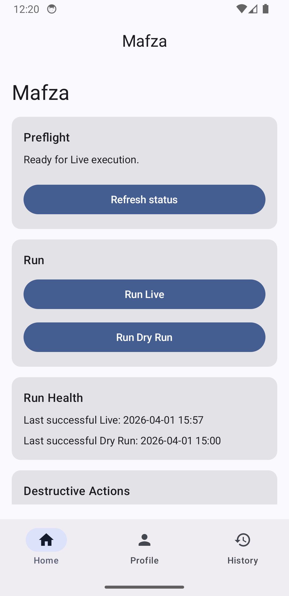
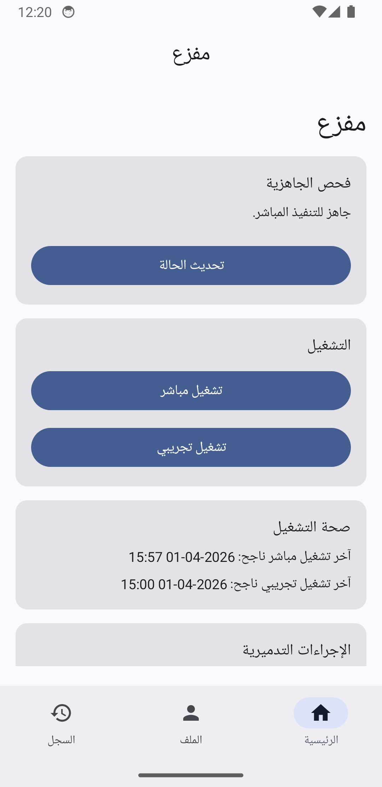
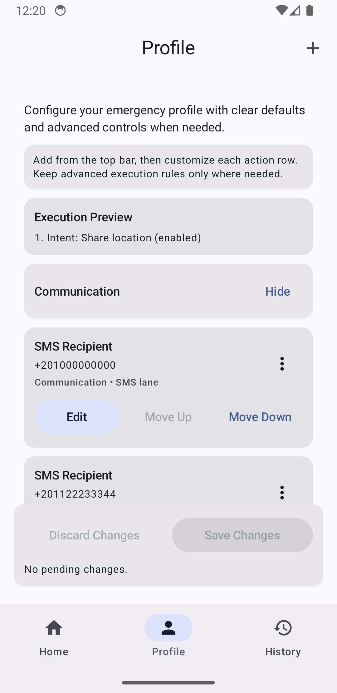
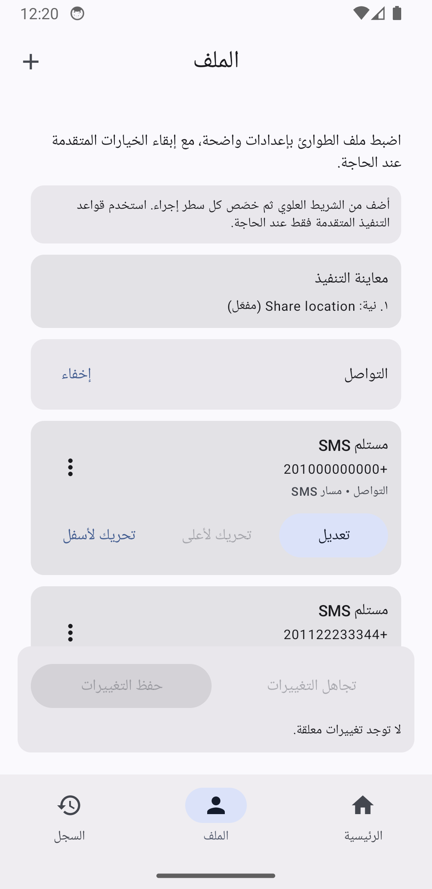
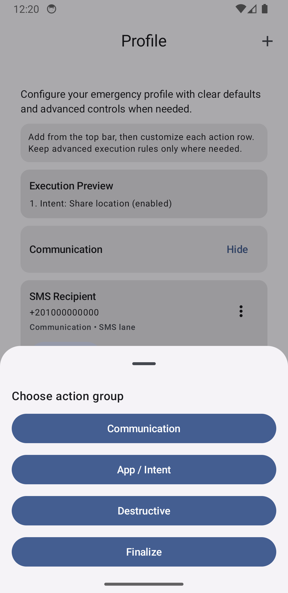
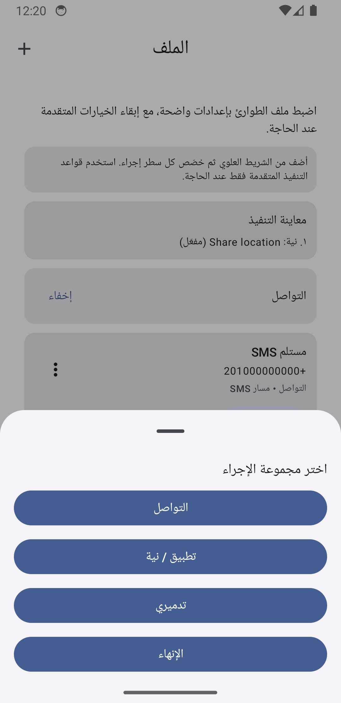
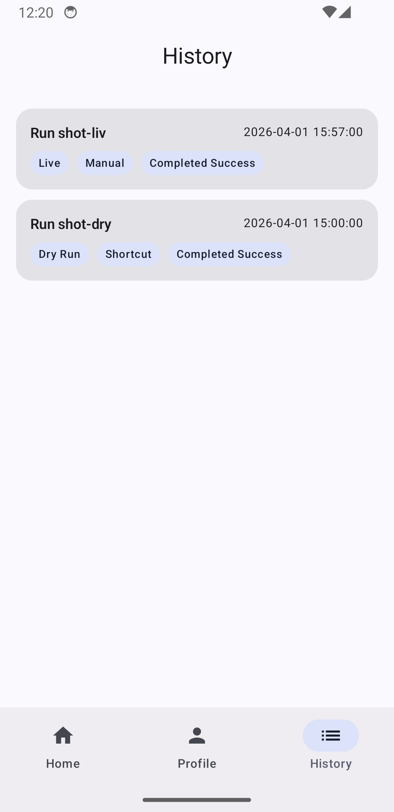
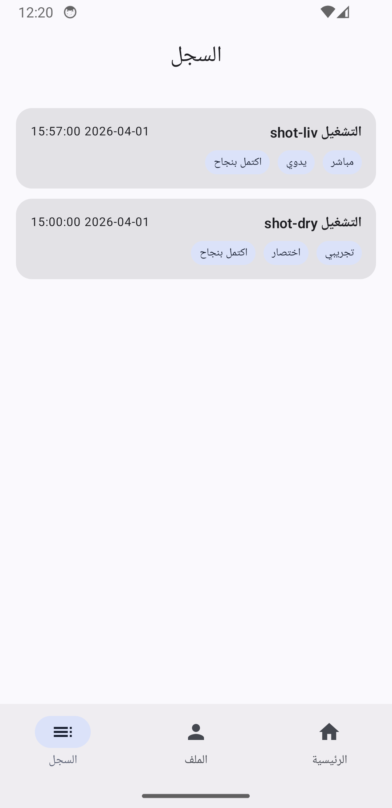

# Mafza

[](https://developer.android.com/)
[](https://kotlinlang.org/)
[](https://developer.android.com/jetpack/compose)
[](https://developer.android.com/about/versions/android-11)
[](https://github.com/RikkaApps/Shizuku)

Emergency actions runner with one configurable profile, external emergency triggers, and a safe Dry Run mode.

> [!CAUTION]
> This project was developed with heavy use of AI assistance, including OpenAI Codex.

## Screenshots

<table>
  <thead>
    <tr>
      <th align="left">English</th>
      <th align="left">Arabic (RTL)</th>
    </tr>
  </thead>
  <tbody>
    <tr>
      <td>
        <div><strong>Home</strong> (preflight + run controls)</div>
        
      </td>
      <td>
        <div><strong>Home</strong> (الصفحة الرئيسية)</div>
        
      </td>
    </tr>
    <tr>
      <td>
        <div><strong>Profile</strong> (actions + policies)</div>
        
      </td>
      <td>
        <div><strong>Profile</strong> (الإعدادات)</div>
        
      </td>
    </tr>
    <tr>
      <td>
        <div><strong>Action Drawer</strong> (available actions)</div>
        
      </td>
      <td>
        <div><strong>Action Drawer</strong> (لوحة الإجراءات)</div>
        
      </td>
    </tr>
    <tr>
      <td>
        <div><strong>History</strong> (runs + statuses)</div>
        
      </td>
      <td>
        <div><strong>History</strong> (السجل)</div>
        
      </td>
    </tr>
  </tbody>
</table>

## What This App Does

- Runs emergency pipelines in `Live` or `Dry Run`.
- Supports external trigger surfaces: launcher shortcut, home widget, and Quick Settings tile.
- Uses a pre-start cancel window and preflight checks before live execution.
- Sends communication actions via SMS, message-app provider bindings, and Telegram bot actions.
- Supports custom intent actions as executable steps.
- Supports destructive actions with explicit allowlists:
  - uninstall package allowlist
  - path/content URI delete allowlist
  - advanced shell commands
- Gates destructive live actions on Shizuku availability/permission.
- Captures run history with step-level statuses and redacted command audit.
- Supports encrypted backup/restore for profile and optional history (replace semantics).
- Captures cell metadata and supports optional OpenCellID fallback when platform location is unavailable.

## Requirements

- Android `minSdk 30` (Android 11+)
- Runtime permissions for configured live features (`ACCESS_FINE_LOCATION`, `ACCESS_BACKGROUND_LOCATION`, `READ_PHONE_STATE`, `SEND_SMS`)
- Shizuku installed/running and permission granted if destructive live actions are enabled
- Optional OpenCellID API key for location fallback

## Architecture

Core pieces:

- `:app` and `:core` modules
- `MainActivity`: Compose host for `Home`, `Profile`, `History`
- `EmergencyExecutionService`: foreground execution runtime and run orchestration
- `EmergencyStartReceiver`: shared external trigger receiver
- `EmergencyShortcutProxyActivity`, `EmergencyWidgetProvider`, `EmergencyQuickSettingsTileService`: trigger surfaces
- `PreflightValidator`: live/dry-run readiness checks
- `EncryptedProfileStore` + DataStore: encrypted profile persistence
- `RunHistoryStore` + Room: run history and command audit retention
- `EncryptedBackupService`: encrypted export/import with rollback on restore failure
- `EmergencyStepsFactory` + step implementations: location, notify, intent, and destructive execution

## Build

This project uses [mise](https://mise.jdx.dev/) for tool management.

```bash
# Build debug APK
./gradlew :app:assembleDebug

# Build release APK
./gradlew :app:assembleRelease

# Run app + core unit tests
./gradlew :core:testDebugUnitTest :app:testDebugUnitTest

# Build instrumentation test APK
./gradlew :app:assembleDebugAndroidTest
```

## Fastlane And Metadata

This repo includes:

- `fastlane/metadata/android/en-US`
- `fastlane/metadata/android/ar`
- screenshot assets under `fastlane/metadata/android/*/images/phoneScreenshots`
- lanes for metadata validation, screenshot capture, and Play upload

Useful commands:

```bash
# Install fastlane gems
bundle install

# Validate metadata
bundle exec fastlane android validate_metadata

# Capture screenshots
bundle exec fastlane android capture_screenshots
```

## CI

GitHub Actions workflows:

- `ci.yml`: lint, unit tests, assemble, instrumentation subset, metadata validation
- `screenshots.yml`: emulator-based screenshot capture and optional PR
- `release.yml`: version/tag flow, screenshot refresh dependency, release artifacts, optional GitHub release

Dependency updates are managed by `renovate.json5`.

## Internal Docs

- Product/technical plan: `docs/PLAN.md`
- Release checklist: `docs/RELEASE_CHECKLIST.md`
- Remaining tasks: `docs/TODO.md`
